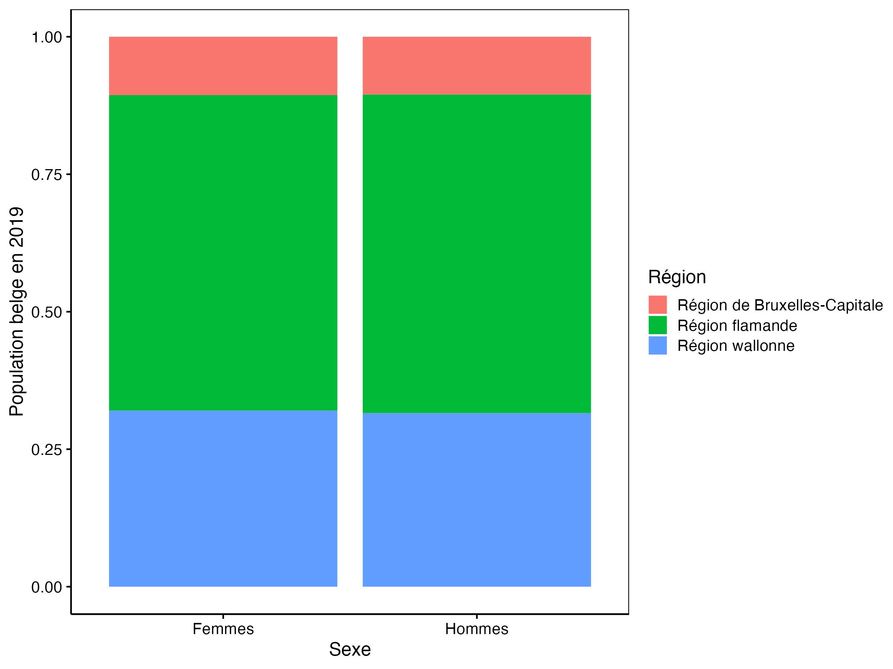

<!--DO NOT EDIT README.md -->

## Avant-propos

Ce projet nécessite d'avoir assimilé l'ensemble des notions du cinquième et du sixième modules du cours de Science des données biologiques I. Ce projet requiert également de maîtriser le deuxième et le troisième modules de ce cours afin de reproduire les graphiques demandés. Il correspond au dépôt GitHub <https://github.com/BioDataScience-Course/A06Ia_belgium_demo>. Il est distribué sous licence [CC BY-NC-SA 4.0](https://creativecommons.org/licenses/by-nc-sa/4.0/).

## Objectif

Ce projet est un projet **individuel**, **court** et **cadré**. Il permettra de démontrer que vous avez acquis les compétences suivantes :

-   Comprendre des données à l'aide de métadonnées
-   Maîtriser l'importation de données dans différents formats
-   Être capable de remodeler des tableaux de données
-   Maîtriser la transformation des variables
-   Gérer les types de variables
-   Pouvoir combiner différents tableaux de données

## Consignes

Reproduisez à l'identique les 3 graphiques ci-dessous en complétant le document `belgium_notebook.qmd`. Les données à utiliser ne sont malheureusement pas proposées sous la forme d'un tableau unique. Vous avez à votre disposition 6 tableaux de données que vous allez devoir recombiner et retravailler afin d'obtenir un tableau unique vous permettant de réaliser les graphiques demandés.

```{r, echo=FALSE, fig.width=5}
knitr::include_graphics("figures/plot1.png")
knitr::include_graphics("figures/plot2.png")

```

Compilez la version finale au format HTML. Vous avez une batterie de tests à votre disposition (onglet "Construire" -\> bouton "Construire tout") pour vérifier l'état de votre travail. Note : utilisez ces tests à la fin. Concentrez-vous d'abord sur vos analyses, puis faites un rendu final du document lorsque tout est complété, et seulement après, utilisez les tests. Il est contre-productif d'activer les tests à chaque nouvelle ligne de code ajoutée dans votre document ! **Afin d'éviter tout abus d'utilisation des tests, vous ne pouvez les utiliser que dix fois dans ce projet.**

Assurez-vous que votre document Quarto compile sans erreurs à la fin de votre travail **(très important : un document qui ne compile pas sans erreur devra être sanctionné de manière importante)**. Vérifiez aussi à la fin que vos derniers commits ont bien été pushés sur GitHub.

## Informations sur les données

L'office belge de statistique Statbel (<https://statbel.fgov.be/fr/propos-de-statbel>) diffuse des données sur l'économie, la société et le territoire belge. Dans ce projet, vous avez à votre disposition des données de recensement de la population belge entre 1992 et 2023 issues de ce site (exportées le 3 décembre 2023) dans le dossier `data` et dans six fichiers distincts avec des formats variés :

-   `bxl_1992-2009.xlsx` : Région de Bruxelles capitale de 1992 à 2009
-   `bxl_2010-2023.xlsx` :  Région de Bruxelles capitale à partir de 2010
-   `flamand_1992-2009.tsv.gz` : Région flamande de 1992 à 2009
-   `flamand_2010-2023.tsv.gz` : Région flamande à partir de 2010
-   `wallon_1992-2009.csv.xz` : Région wallonne de 1992 à 2009
-   `wallon_2010-2023.csv.xz` : Région wallonne à partir de 2010

Un dictionnaire des données est également mis à votre disposition :

```{r, warning=FALSE, message=FALSE}
knitr::kable(data.io::read$csv2("data/region_meta.csv"))
```

L'office belge de statistique Statbel explicite la licence associée via le lien suivant <https://statbel.fgov.be/sites/default/files/files/opendata/Licence%20open%20data_FR.pdf>
