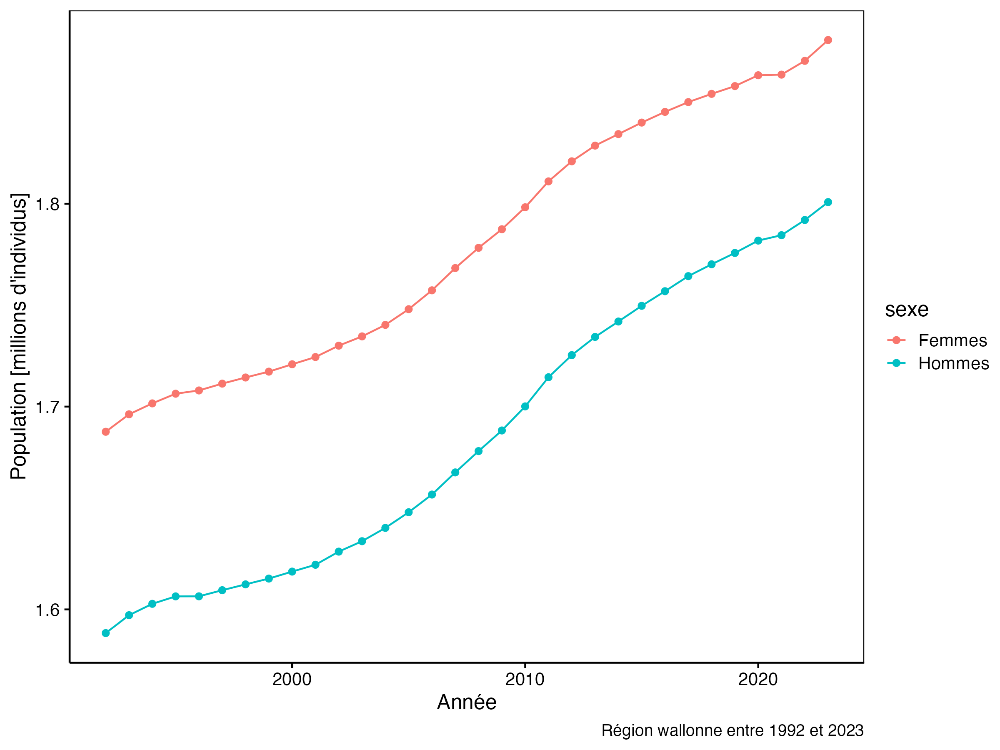

<!--DO NOT EDIT README.md -->

## Informations sur les données

L'office belge de statistique Statbel diffuse des données fiables sur l'économie, la société et le territoire belge. Pour en apprendre plus sur l'office belge de statistique, vous pouvez consulter le lien suivant : <https://statbel.fgov.be/fr/propos-de-statbel>. Statbel étudie la démographie en Belgique au cours du temps.

Vous avez à votre disposition des données liées à la densité de population entre 1992 et 2019. Dans le dossier `data`, vous retrouvez diverses informations relatives à la population belge dans six fichiers distincts :

-   `region\_bxl\_ap\_2000.rds` : recensement de la population de la région de Bruxelles capitale à partir de l'année 2000.
-   `region\_bxl\_av\_2000.rds` : recensement de la population de la région de Bruxelles capitale entre 1992 et 1999
-   `region\_flamande\_ap\_2000.xls` : recensement de la population de la Région flamande à partir de l'année 2000
-   `region\_flamande\_av\_2000.xls` : recensement de la population de la Région flamande entre 1992 et 1999
-   `region\_wallonne\_ap\_2000.csv` : recensement de la population de la Région wallonne à partir de l'année 2000
-   `region\_wallonne\_av\_2000.csv` : recensement de la population de la Région wallonne entre 1992 et 1999

Un dictionnaire des données est également proposé à votre disposition.

```{r, warning=FALSE, message=FALSE}
knitr::kable(data.io::read$csv2("data/region_bxl_ap_2000_meta.csv"))
```

## Objectif

Ce projet est un projet **individuel**, **court** et **cadré**. Il permettra de démontrer que vous avez acquis les compétences suivantes :

-   Comprendre des données à l'aide de métadonnées
-   Maîtriser l'importation de données multiformats
-   Être capable de remodeler des tableaux de données
-   Maîtriser la transformation des variables
-   Gérer les types de variables
-   Pouvoir combiner différents tableaux de données

## Consignes

Vous devez commencer ce projet par importer et remanier les six tableaux de données afin de produire un unique tableau que vous allez sauvegarder au sein de votre projet (nom du fichier, format et dossier doivent être choisis de manière judicieuse). Ces étapes doivent être réalisées dans le script `R/belgium_import.R` obligatoirement.

Dans le document `docs/belgium_notebook.Rmd`, reproduisez les graphiques demandées à l'identique.





Le template est associé au projet suivant : <https://github.com/BioDataScience-Course/A06Ia_belgium_demo>
