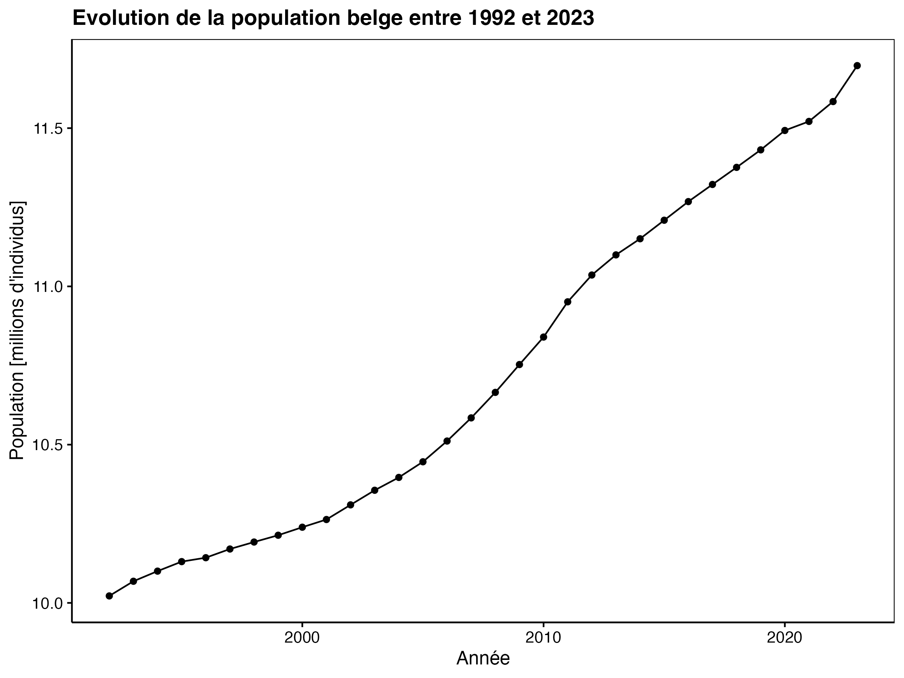

<!--DO NOT EDIT README.md -->

## Informations sur les données

L'office belge de statistique Statbel (<https://statbel.fgov.be/fr/propos-de-statbel>) diffuse des données sur l'économie, la société et le territoire belge. Dans ce projet, vus avez à votre disposition des données de recensement de la population belge entre 1992 et 2019 issues de ce site dans le dossier `data` et dans six fichiers distincts :

-   `region_bxl_ap_2000.rds` : région de Bruxelles capitale à partir de l'année 2000.
-   `region_bxl_av_2000.rds` : région de Bruxelles capitale entre 1992 et 1999
-   `region_flamande_ap_2000.xls` : région flamande à partir de l'année 2000
-   `region_flamande_av_2000.xls` : région flamande entre 1992 et 1999
-   `region_wallonne_ap_2000.csv` : région wallonne à partir de l'année 2000
-   `region_wallonne_av_2000.csv` : région wallonne entre 1992 et 1999

Un dictionnaire des données est également mis à votre disposition :

```{r, warning=FALSE, message=FALSE}
knitr::kable(data.io::read$csv2("data/region_meta.csv"))
```

## Objectif

Ce projet est un projet **individuel**, **court** et **cadré**. Il permettra de démontrer que vous avez acquis les compétences suivantes :

-   Comprendre des données à l'aide de métadonnées
-   Maîtriser l'importation de données dans différents formats
-   Être capable de remodeler des tableaux de données
-   Maîtriser la transformation des variables
-   Gérer les types de variables
-   Pouvoir combiner différents tableaux de données

## Consignes

Importez et remaniez les six tableaux de données afin de produire un tableau unique que vous allez sauvegarder dans votre projet sous `data/belgium.rds`. Ces étapes seront réalisées dans le script `R/belgium_import.R` obligatoirement.

Dans le document `docs/belgium_notebook.Rmd`, reproduisez les trois graphiques ci-dessous à l'identique (un remaniement des données est peut-être nécessaire pour y arriver).

```{r, echo=FALSE, fig.width=5}

knitr::include_graphics("figures/plot2.png")
knitr::include_graphics("figures/plot3.png")
```

Le template de ce projet est le suivant : <https://github.com/BioDataScience-Course/A06Ia_belgium_demo>
