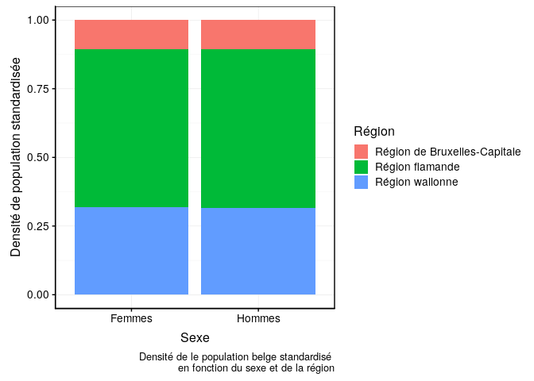
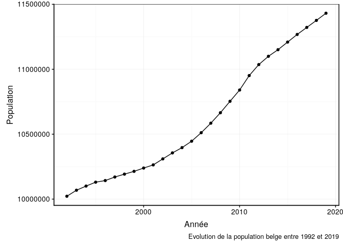
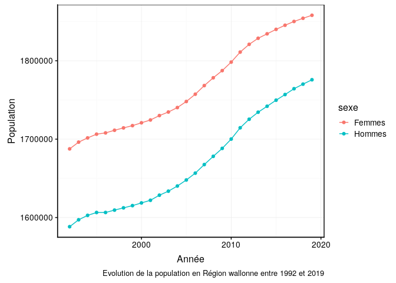

# Démographie en Belgique

## Avant-propos

Les consignes sont reprises dans ce document, ainsi que sous forme de commentaires dans les différents fichiers. Elles sont susceptibles d'évoluer. N'hésitez pas à vérifier le lien suivant afin de voir si des modifications n'y ont pas été apportées : https://github.com/BioDataScience-Course/A06Ga_belgium_demo.

## Objectifs

Ce projet est à réaliser en **équipe**. Il s'agit d'un projet **libre** qui vous permet de démontrer l'acquisition des compétences suivantes :

- Être autonome face à un nouveau projet
- Comprendre des données à l'aide de métadonnées
- Maîtriser l'importation de données multiformats
- Être capable de remodeler des tableaux de données
- Maîtriser la transformation des variables
- Gérer les types de variables
- Pouvoir combiner différents tableaux de données
- Réaliser des graphiques corrects et informatifs
- Interpréter des graphiques 
- Consigner ses observations dans un carnet de notes et puis en extraire l'essentiel dans un rapport scientifique

## Consignes

L’office belge de statistique Statbel diffuse des données fiables sur l’économie, la société et le territoire belge. Pour en apprendre plus sur l’office belge de statistique, vous pouvez
consulter le lien suivant :
<https://statbel.fgov.be/fr/propos-de-statbel>

Vous vous intéressez à la démographie en Belgique. Vous avez à votre disposition des données liées à la densité de population entre 1992 et 2019. Dans le dossier `data` vous retrouvez diverses informations relatives à la population belge dans six fichiers distincts :

- `region\_bxl\_ap\_2000.rds` : recensement de la population de la région de Bruxelles capitale à partir de l'année 2000. `region_bxl_ap_2000_meta.csv` décrit les données (identiques pour les tableaux suivants)
- `region\_bxl\_av\_2000.rds` : recensement de la population de la région de Bruxelles capitale entre 1992 et 1999
- `region\_flamande\_ap\_2000.xls` : recensement de la population de la Région flamande à partir de l'année 2000
- `region\_flamande\_av\_2000.xls` : recensement de la population de la Région flamande entre 1992 et 1999
- `region\_wallonne\_ap\_2000.csv` : recensement de la population de la Région wallonne à partir de l'année 2000
- `region\_wallonne\_av\_2000.csv` : recensement de la population de la Région wallonne entre 1992 et 1999
- 

Vous devez commencer, dans ce projet, par importer et remanier les six tableaux de données afin de produire un unique tableau que vous allez sauvegarder au sein de votre projet (nom du fichier, format et dossier doivent être choisis de manière judicieuse). Ces étapes doivent être réalisées dans le script `R/belgium_import.R` obligatoirement.

**Note :** N’oubliez pas de commenter votre code afin qu’il soit facilement compréhensibles par un collaborateur ou par vous-même plus tard.

Vous devez ensuite réaliser entre 15 et 20 graphiques ou tableaux résumant l'information sur la démographie en Belgique dans votre carnet de notes. Chaque graphique doit avoir des labels et des unités corrects. Chaque graphique proposé doit être commenté.

Vous devez enfin reprendre les 5 à 6 graphiques ou tableaux les plus importants de votre étude dans un rapport de synthèse de la démographie en Belgique. Les graphiques ou tableaux doivent provenir de votre carnet de notes. Vous structurez votre rapport de manière classique (voir note dans le rapport).

**Attention :** Vous travaillerez par groupe de quatre. Répartissez-vous le travail, gérez les conflits éventuels et arrangez-vous pour que les contributions de chacun soient équitables (telles que visibles via les commits dans le dépôt sur GitHub) !

### Graphiques imposés

Parmi les graphiques que vous réalisez dans votre carnet de notes, trois d'entre eux doivent reproduire à l'identique les figures ci-dessous.

